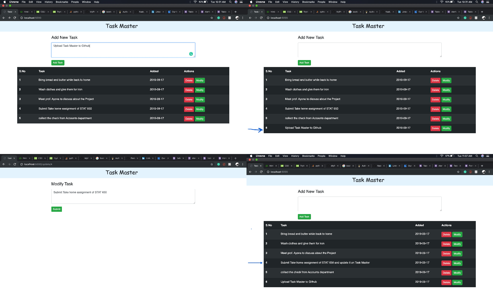

""" TASK KEEPER """

  

Created to help users  keep track of their tasks by using Python with Flask for the backend and SQLAlchemy for the database.

List of the pages:
- Main Page(Dashboard):
 - Adding new task section.
 - displaying added tasks with delete and update options.
- Modify page:
 - Update page is created differently.

# Backend
- Settled Flask server for handling GET and POST requests.
- Designed necessary Flask routes.
- Designed Task class and implemented by using Flask SQLAlchemy.

# Task
- Short description of the Task
- Date it was created
- ID of the Task
